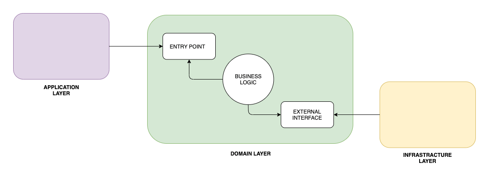
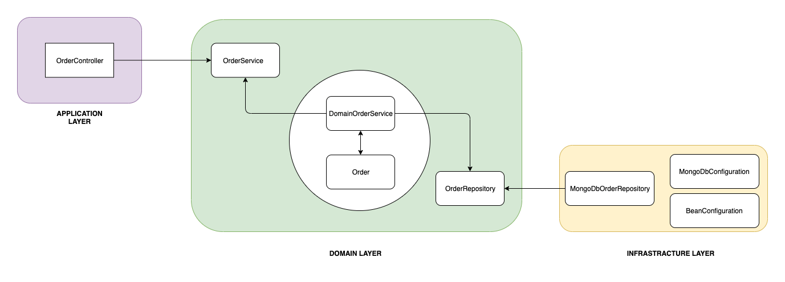
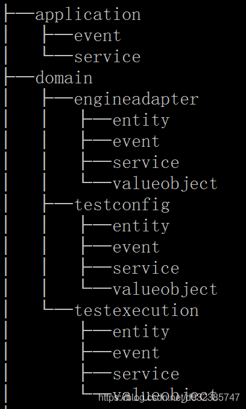
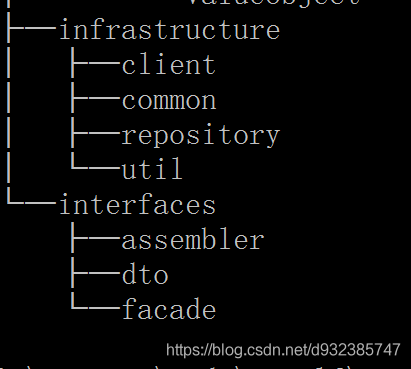

六边形架构
==========

六边形架构是一种围绕领域逻辑,设计软件应用程序,以将其与外部因素隔离的模型。

domain
逻辑在业务核心中指定，我们将其称为内部部分，其余部分称为外部部分。可以通过端口和适配器从外部访问域逻辑。

原则
====

1.  首先，我们应该定义划分代码的原则。如前所述，六边形建筑定义了
    **内部和外部**。

2.  我们要做的是,将我们的应用程序分成三层； `application` (outside),
    `domain` (inside), and `infrastructure` (outside):

    

3.  通过 `application`
    层，用户或任何其他程序与应用程序进行交互。该区域应包含 `用户界面`
    、`RESTful 控制器` 和 `JSON 序列化库`
    等内容。它包括任何向我们的应用程序公开入口并协调 `domain`
    逻辑执行的内容。

4.  在 `domain`
    层，我们保留接触和实现业务逻辑的代码。这是我们应用程序的核心。此外，该层应与应用程序部分和基础设施部分隔离。最重要的是，它还应该包含定义
    API 以与 `domain` 交互的外部部分（如数据库）通信的接口。

5.  最后，基础设施层是包含应用程序运行所需的任何内容的部分，例如数据库配置或
    Spring 配置。此外，它还从域层实现了依赖于基础设施的接口。

`Domain` 层
===========

核心层，即领域层

1.  创建 `order` 类

        public class Order {
            private UUID id;
            private OrderStatus status;
            private List<OrderItem> orderItems;
            private BigDecimal price;

            public Order(UUID id, Product product) {
                this.id = id;
                this.orderItems = new ArrayList<>(Arrays.astList(new OrderItem(product)));
                this.status = OrderStatus.CREATED;
                this.price = product.getPrice();
            }

            public void complete() {
                validateState();
                this.status = OrderStatus.COMPLETED;
            }

            public void addOrder(Product product) {
                validateState();
                validateProduct(product);
                orderItems.add(new OrderItem(product));
                price = price.add(product.getPrice());
            }

            public void removeOrder(UUID id) {
                validateState();
                final OrderItem orderItem = getOrderItem(id);
                orderItems.remove(orderItem);

                price = price.subtract(orderItem.getPrice());
            }

            // getters
        }

这是我们的 `aggregate root`
。任何与我们的业务逻辑相关的东西都将通过这个类。此外，`Order`
负责将自身保持在正确的状态： \* 订单只能使用给定的 ID 并基于一个产品创建
- 构造函数本身也以 CREATED 状态初始化订单 \* 一旦订单完成，就无法更改
OrderItems \* 不可能像使用 setter 一样从域对象外部更改 Order

\+ 此外，Order 类还负责创建它的 OrderItem。

\+

    public class OrderItem {
        private UUID productId;
        private BigDecimal price;

        public OrderItem(Product product) {
            this.productId = product.getId();
            this.price = product.getPrice();
        }

        // getters
    }

\+ TIP: 如我们所见，OrderItem 是基于 Product
创建的。它保留对它的引用并存储产品的当前价格。

1.  我们将创建一个 `repository` 接口（Hexagonal Architecture
    中的一个端口）。接口的实现将在 `infrastructure` 层：

        public interface OrderRepository {
            Optional<Order> findById(UUID id);

            void save(Order order);
        }

2.  最后，我们应该确保每次操作后都会保存订单。为此，我们将定义一个
    `Domain Service` ，它通常包含不能成为我们根的一部分的逻辑：

        public class DomainOrderService implements OrderService {

            private final OrderRepository orderRepository;

            public DomainOrderService(OrderRepository orderRepository) {
                this.orderRepository = orderRepository;
            }

            @Override
            public UUID createOrder(Product product) {
                Order order = new Order(UUID.randomUUID(), product);
                orderRepository.save(order);

                return order.getId();
            }

            @Override
            public void addProduct(UUID id, Product product) {
                Order order = getOrder(id);
                order.addOrder(product);

                orderRepository.save(order);
            }

            @Override
            public void completeOrder(UUID id) {
                Order order = getOrder(id);
                order.complete();

                orderRepository.save(order);
            }

            @Override
            public void deleteProduct(UUID id, UUID productId) {
                Order order = getOrder(id);
                order.removeOrder(productId);

                orderRepository.save(order);
            }

            private Order getOrder(UUID id) {
                return orderRepository
                  .findById(id)
                  .orElseThrow(RuntimeException::new);
            }
        }

    在六边形架构中，该服务是实现端口的适配器。此外，我们不会将其注册为
    Spring bean，因为从域的角度来看，这是在内部，而 Spring
    配置在外部。稍后我们将在基础设施层手动将其与 Spring 连接。

3.  由于领域层与应用层和基础设施层完全解耦，我们也可以独立测试：

        class DomainOrderServiceUnitTest {

            private OrderRepository orderRepository;
            private DomainOrderService tested;
            @BeforeEach
            void setUp() {
                orderRepository = mock(OrderRepository.class);
                tested = new DomainOrderService(orderRepository);
            }

            @Test
            void shouldCreateOrder_thenSaveIt() {
                final Product product = new Product(UUID.randomUUID(), BigDecimal.TEN, "productName");

                final UUID id = tested.createOrder(product);

                verify(orderRepository).save(any(Order.class));
                assertNotNull(id);
            }
        }

Application Layer
=================

在本节中，我们将实现应用层。我们将允许用户通过 RESTful API
与我们的应用程序进行通信。

    @RestController
    @RequestMapping("/orders")
    public class OrderController {

        private OrderService orderService;

        @Autowired
        public OrderController(OrderService orderService) {
            this.orderService = orderService;
        }

        @PostMapping
        CreateOrderResponse createOrder(@RequestBody CreateOrderRequest request) {
            UUID id = orderService.createOrder(request.getProduct());

            return new CreateOrderResponse(id);
        }

        @PostMapping(value = "/{id}/products")
        void addProduct(@PathVariable UUID id, @RequestBody AddProductRequest request) {
            orderService.addProduct(id, request.getProduct());
        }

        @DeleteMapping(value = "/{id}/products")
        void deleteProduct(@PathVariable UUID id, @RequestParam UUID productId) {
            orderService.deleteProduct(id, productId);
        }

        @PostMapping("/{id}/complete")
        void completeOrder(@PathVariable UUID id) {
            orderService.completeOrder(id);
        }
    }

这个简单的 Spring Rest 控制器负责编排domain逻辑的执行。 该控制器使外部
RESTful 接口适应我们的域。它通过从
OrderService（端口）调用适当的方法来实现。

Infrastructure Layer
====================

基础设施层包含运行应用程序所需的逻辑。  
因此，我们将从创建配置类开始。

1.  首先，让我们实现一个将 OrderService 注册为 Spring bean 的类：

        @Configuration
        public class BeanConfiguration {

            @Bean
            OrderService orderService(OrderRepository orderRepository) {
                return new DomainOrderService(orderRepository);
            }
        }

2.  接下来，让我们创建负责启用我们将使用的 Spring Data 存储库的配置：

        @EnableMongoRepositories(basePackageClasses = SpringDataMongoOrderRepository.class)
        public class MongoDBConfiguration {
        }

我们使用了 basePackageClasses
属性，因为这些存储库只能位于基础设施层。因此，Spring
没有理由扫描整个应用程序。此外，这个类可以包含与在 MongoDB
和我们的应用程序之间建立连接相关的所有内容。

1.  最后，我们将从domain层实现
    OrderRepository。我们将在我们的实现中使用我们的
    SpringDataMongoOrderRepository：

        @Component
        public class MongoDbOrderRepository implements OrderRepository {

            private SpringDataMongoOrderRepository orderRepository;

            @Autowired
            public MongoDbOrderRepository(SpringDataMongoOrderRepository orderRepository) {
                this.orderRepository = orderRepository;
            }

            @Override
            public Optional<Order> findById(UUID id) {
                return orderRepository.findById(id);
            }

            @Override
            public void save(Order order) {
                orderRepository.save(order);
            }
        }

这个实现将我们的订单存储在 MongoDB
中。在六边形架构中，这个实现也是一个适配器。

Benefits
========

1.  这种方法的第一个优点是我们将每一层的工作分开。我们可以专注于一层而不影响其他层。

2.  此外，它们自然更容易理解，因为它们每个都专注于其逻辑。

3.  另一个很大的优势是我们将域逻辑与其他所有内容隔离开来。域部分仅包含业务逻辑，可以轻松移动到不同的环境。

实际上，让我们更改基础设施层以使用 Cassandra 作为数据库：

    @Component
    public class CassandraDbOrderRepository implements OrderRepository {

        private final SpringDataCassandraOrderRepository orderRepository;

        @Autowired
        public CassandraDbOrderRepository(SpringDataCassandraOrderRepository orderRepository) {
            this.orderRepository = orderRepository;
        }

        @Override
        public Optional<Order> findById(UUID id) {
            Optional<OrderEntity> orderEntity = orderRepository.findById(id);
            if (orderEntity.isPresent()) {
                return Optional.of(orderEntity.get()
                    .toOrder());
            } else {
                return Optional.empty();
            }
        }

        @Override
        public void save(Order order) {
            orderRepository.save(new OrderEntity(order));
        }

    }

与 MongoDB 不同，我们现在使用 OrderEntity 将域保存在数据库中。

如果我们向 Order
域对象添加特定于技术的注释，那么我们就违反了基础设施层和域层之间的解耦。

存储库使域适应我们的持久性需求。

让我们更进一步，将我们的 RESTful 应用程序转换为命令行应用程序：

    @Component
    public class CliOrderController {

        private static final Logger LOG = LoggerFactory.getLogger(CliOrderController.class);

        private final OrderService orderService;

        @Autowired
        public CliOrderController(OrderService orderService) {
            this.orderService = orderService;
        }

        public void createCompleteOrder() {
            LOG.info("<<Create complete order>>");
            UUID orderId = createOrder();
            orderService.completeOrder(orderId);
        }

        public void createIncompleteOrder() {
            LOG.info("<<Create incomplete order>>");
            UUID orderId = createOrder();
        }

        private UUID createOrder() {
            LOG.info("Placing a new order with two products");
            Product mobilePhone = new Product(UUID.randomUUID(), BigDecimal.valueOf(200), "mobile");
            Product razor = new Product(UUID.randomUUID(), BigDecimal.valueOf(50), "razor");
            LOG.info("Creating order with mobile phone");
            UUID orderId = orderService.createOrder(mobilePhone);
            LOG.info("Adding a razor to the order");
            orderService.addProduct(orderId, razor);
            return orderId;
        }
    }

与以前不同，我们现在已经硬连线了一组与我们的域交互的预定义操作。例如，我们可以使用它来用模拟数据填充我们的应用程序。

即使我们完全改变了应用程序的目的，我们也没有触及领域层。

总结
====

在本文中，我们学习了如何将与我们的应用程序相关的逻辑分成特定的层。

首先，我们定义了三个主要层：应用程序、域和基础设施。之后，我们描述了如何填充它们并解释了优点。

然后，我们想出了每一层的实现：

最后，我们在不影响领域的情况下交换了应用程序和基础设施层。
与往常一样，这些示例的代码可在 GitHub 上找到。

其它参考
========

流行分包之一
------------

1.  DDD：application应用层

    相对于领域层，应用层是很薄的一层，应用定义了软件要完成的任务，要尽量简单  
    它不包含任何业务规则或只是，为下一层的领域对象协助任务、委托工作。  
    它没有反应业务情况的状态，但他可以具有反应用户或程序的某个任的进展状态.

    1.  负责上下文协调，对外为展现层提供各种应用应用功能（service）.

    2.  对内调用领域层（领域对象或领域服务）完成各种业务逻辑任务（event）。

        这一层也很适合写一些任务处理、日志监控。

2.  DDD：domain 领域层

    领域层主要负责表达业务概念、业务状态信息和业务规则。  
    Domain层是整个系统的核心层，几乎全部的业务逻辑会在该层实现。  
    领域模型层主要包含以下的内容：

    1.  实体（entity）：具有唯一标识的对象。

    2.  值对象（value object）：无需唯一标识的对象。

    3.  领域服务（service）：一些行为无法归类到实体对象或者值对象上，本质是一些操作，而非事务

3.  DDD：infrastructure 基础设施层，最底层（但与所有底层进行交互）

    向其他层提供通用的技术能力（比如工具类、第三方库类支出、常用的基本配置、数据访问底层实现）  
    基础实施层主要包含以下内容：

    1.  为应用层传递消息

    2.  为领域层提供持久化机制

    3.  为用户界面层提供组件配置

    4.  基础设施层还可以通过架构框架来支持四个层次间的交互模式。

4.  DDD：interface 用户界面层（或表示层） 最顶层。

    负责向用户显示信息和解释用户命令。  
    请求应用层以获取用户所需要展现的数据（比如获取应用系统数据）。  
    发送命令给应用层要求其执行某个用户命令（实现某个业务逻辑，比如用户新增应用系统）。  
    用户界面层包含以下内容：

    1.  数据传输对象（data transfer
        object）：DTO也被常称作值对象，是数据传输的载体，内部不应该存在任何业务逻辑，
        通过DTO把内部的领域对象与外界隔离。

    2.  装配（assembler）：实现DTO与领域对象之间的相互转换、数据交换，因此assembler几乎总是同DTO一起出现。

    3.  表面，门面（facade）:facade的用意在于为远程客户端提供粗粒度的调用接口，它的主要工作就是将一个用户请求委派给一个或者多个service进行处理，也是常用的controller。

= 领域驱动设计 :imagesdir: docs/assets/images :icons: font :toc: left
:toclevels: 4 :tabsize: 4 :numbered: :source-highlighter: coderay
:origin-blog: https://www.baeldung.com/hexagonal-architecture-ddd-spring
:github-source: Finally, we swapped the application and infrastructure
layers without impacting the domain. == 六边形架构
六边形架构是一种围绕领域逻辑,设计软件应用程序,以将其与外部因素隔离的模型。
domain
逻辑在业务核心中指定，我们将其称为内部部分，其余部分称为外部部分。可以通过端口和适配器从外部访问域逻辑。
== 原则 . 首先，我们应该定义划分代码的原则。如前所述，六边形建筑定义了
\*\*内部和外部\*\*。 . 我们要做的是,将我们的应用程序分成三层；
\`application\` (outside), \`domain\` (inside), and \`infrastructure\`
(outside): + image::DDD-Layers.png\[\] . 通过 \`application\`
层，用户或任何其他程序与应用程序进行交互。该区域应包含 \`用户界面\`
、\`RESTful 控制器\` 和 \`JSON 序列化库\`
等内容。它包括任何向我们的应用程序公开入口并协调 \`domain\`
逻辑执行的内容。 . 在 \`domain\`
层，我们保留接触和实现业务逻辑的代码。这是我们应用程序的核心。此外，该层应与应用程序部分和基础设施部分隔离。最重要的是，它还应该包含定义
API 以与 \`domain\` 交互的外部部分（如数据库）通信的接口。 .
最后，基础设施层是包含应用程序运行所需的任何内容的部分，例如数据库配置或
Spring 配置。此外，它还从域层实现了依赖于基础设施的接口。 == \`Domain\`
层 核心层，即领域层 . 创建 \`order\` 类 + \[source,java\] ---- public
class Order { private UUID id; private OrderStatus status; private List

orderItems; private BigDecimal price; public Order(UUID id, Product
product) { this.id = id; this.orderItems = new ArrayList

(Arrays.astList(new OrderItem(product))); this.status =
OrderStatus.CREATED; this.price = product.getPrice(); } public void
complete() { validateState(); this.status = OrderStatus.COMPLETED; }
public void addOrder(Product product) { validateState();
validateProduct(product); orderItems.add(new OrderItem(product)); price
= price.add(product.getPrice()); } public void removeOrder(UUID id) {
validateState(); final OrderItem orderItem = getOrderItem(id);
orderItems.remove(orderItem); price =
price.subtract(orderItem.getPrice()); } // getters } ---- 这是我们的
\`aggregate root\`
。任何与我们的业务逻辑相关的东西都将通过这个类。此外，\`Order\`
负责将自身保持在正确的状态： \* 订单只能使用给定的 ID 并基于一个产品创建
- 构造函数本身也以 CREATED 状态初始化订单 \* 一旦订单完成，就无法更改
OrderItems \* 不可能像使用 setter 一样从域对象外部更改 Order +
此外，Order 类还负责创建它的 OrderItem。 + \[source,java\] ---- public
class OrderItem { private UUID productId; private BigDecimal price;
public OrderItem(Product product) { this.productId = product.getId();
this.price = product.getPrice(); } // getters } ---- + TIP:
如我们所见，OrderItem 是基于 Product
创建的。它保留对它的引用并存储产品的当前价格。 . 我们将创建一个
\`repository\` 接口（Hexagonal Architecture
中的一个端口）。接口的实现将在 \`infrastructure\` 层： + \[source,java\]
---- public interface OrderRepository { Optional

findById(UUID id); void save(Order order); } ---- .
最后，我们应该确保每次操作后都会保存订单。为此，我们将定义一个 \`Domain
Service\` ，它通常包含不能成为我们根的一部分的逻辑： + \[source,java\]
---- public class DomainOrderService implements OrderService { private
final OrderRepository orderRepository; public
DomainOrderService(OrderRepository orderRepository) {
this.orderRepository = orderRepository; } @Override public UUID
createOrder(Product product) { Order order = new
Order(UUID.randomUUID(), product); orderRepository.save(order); return
order.getId(); } @Override public void addProduct(UUID id, Product
product) { Order order = getOrder(id); order.addOrder(product);
orderRepository.save(order); } @Override public void completeOrder(UUID
id) { Order order = getOrder(id); order.complete();
orderRepository.save(order); } @Override public void deleteProduct(UUID
id, UUID productId) { Order order = getOrder(id);
order.removeOrder(productId); orderRepository.save(order); } private
Order getOrder(UUID id) { return orderRepository .findById(id)
.orElseThrow(RuntimeException::new); } } ---- +
在六边形架构中，该服务是实现端口的适配器。此外，我们不会将其注册为
Spring bean，因为从域的角度来看，这是在内部，而 Spring
配置在外部。稍后我们将在基础设施层手动将其与 Spring 连接。 .
由于领域层与应用层和基础设施层完全解耦，我们也可以独立测试： +
\[source,java\] ---- class DomainOrderServiceUnitTest { private
OrderRepository orderRepository; private DomainOrderService tested;
@BeforeEach void setUp() { orderRepository =
mock(OrderRepository.class); tested = new
DomainOrderService(orderRepository); } @Test void
shouldCreateOrder\_thenSaveIt() { final Product product = new
Product(UUID.randomUUID(), BigDecimal.TEN, "productName"); final UUID id
= tested.createOrder(product);
verify(orderRepository).save(any(Order.class)); assertNotNull(id); } }
---- == Application Layer 在本节中，我们将实现应用层。我们将允许用户通过
RESTful API 与我们的应用程序进行通信。 \[source, java\] ----
@RestController @RequestMapping("/orders") public class OrderController
{ private OrderService orderService; @Autowired public
OrderController(OrderService orderService) { this.orderService =
orderService; } @PostMapping CreateOrderResponse
createOrder(@RequestBody CreateOrderRequest request) { UUID id =
orderService.createOrder(request.getProduct()); return new
CreateOrderResponse(id); } @PostMapping(value = "/{id}/products") void
addProduct(@PathVariable UUID id, @RequestBody AddProductRequest
request) { orderService.addProduct(id, request.getProduct()); }
@DeleteMapping(value = "/{id}/products") void
deleteProduct(@PathVariable UUID id, @RequestParam UUID productId) {
orderService.deleteProduct(id, productId); }
@PostMapping("/{id}/complete") void completeOrder(@PathVariable UUID id)
{ orderService.completeOrder(id); } } ---- 这个简单的 Spring Rest
控制器负责编排domain逻辑的执行。 该控制器使外部 RESTful
接口适应我们的域。它通过从 OrderService（端口）调用适当的方法来实现。 ==
Infrastructure Layer 基础设施层包含运行应用程序所需的逻辑。 +
因此，我们将从创建配置类开始。 . 首先，让我们实现一个将 OrderService
注册为 Spring bean 的类： + \[source,java\] ---- @Configuration public
class BeanConfiguration { @Bean OrderService
orderService(OrderRepository orderRepository) { return new
DomainOrderService(orderRepository); } } ---- .
接下来，让我们创建负责启用我们将使用的 Spring Data 存储库的配置： +
\[source,java\] ---- @EnableMongoRepositories(basePackageClasses =
SpringDataMongoOrderRepository.class) public class MongoDBConfiguration
{ } ---- 我们使用了 basePackageClasses
属性，因为这些存储库只能位于基础设施层。因此，Spring
没有理由扫描整个应用程序。此外，这个类可以包含与在 MongoDB
和我们的应用程序之间建立连接相关的所有内容。 .
最后，我们将从domain层实现
OrderRepository。我们将在我们的实现中使用我们的
SpringDataMongoOrderRepository： + \[source,java\] ---- @Component
public class MongoDbOrderRepository implements OrderRepository { private
SpringDataMongoOrderRepository orderRepository; @Autowired public
MongoDbOrderRepository(SpringDataMongoOrderRepository orderRepository) {
this.orderRepository = orderRepository; } @Override public Optional

findById(UUID id) { return orderRepository.findById(id); } @Override
public void save(Order order) { orderRepository.save(order); } } ----
这个实现将我们的订单存储在 MongoDB
中。在六边形架构中，这个实现也是一个适配器。 == Benefits .
这种方法的第一个优点是我们将每一层的工作分开。我们可以专注于一层而不影响其他层。
. 此外，它们自然更容易理解，因为它们每个都专注于其逻辑。 .
另一个很大的优势是我们将域逻辑与其他所有内容隔离开来。域部分仅包含业务逻辑，可以轻松移动到不同的环境。
实际上，让我们更改基础设施层以使用 Cassandra 作为数据库：
\[source,java\] ---- @Component public class CassandraDbOrderRepository
implements OrderRepository { private final
SpringDataCassandraOrderRepository orderRepository; @Autowired public
CassandraDbOrderRepository(SpringDataCassandraOrderRepository
orderRepository) { this.orderRepository = orderRepository; } @Override
public Optional

findById(UUID id) { Optional

orderEntity = orderRepository.findById(id); if (orderEntity.isPresent())
{ return Optional.of(orderEntity.get() .toOrder()); } else { return
Optional.empty(); } } @Override public void save(Order order) {
orderRepository.save(new OrderEntity(order)); } } ---- 与 MongoDB
不同，我们现在使用 OrderEntity 将域保存在数据库中。 如果我们向 Order
域对象添加特定于技术的注释，那么我们就违反了基础设施层和域层之间的解耦。
存储库使域适应我们的持久性需求。 让我们更进一步，将我们的 RESTful
应用程序转换为命令行应用程序： \[source,java\] ---- @Component public
class CliOrderController { private static final Logger LOG =
LoggerFactory.getLogger(CliOrderController.class); private final
OrderService orderService; @Autowired public
CliOrderController(OrderService orderService) { this.orderService =
orderService; } public void createCompleteOrder() { LOG.info("

&gt;"); UUID orderId = createOrder();
orderService.completeOrder(orderId); } public void
createIncompleteOrder() { LOG.info("

&gt;"); UUID orderId = createOrder(); } private UUID createOrder() {
LOG.info("Placing a new order with two products"); Product mobilePhone =
new Product(UUID.randomUUID(), BigDecimal.valueOf(200), "mobile");
Product razor = new Product(UUID.randomUUID(), BigDecimal.valueOf(50),
"razor"); LOG.info("Creating order with mobile phone"); UUID orderId =
orderService.createOrder(mobilePhone); LOG.info("Adding a razor to the
order"); orderService.addProduct(orderId, razor); return orderId; } }
----
与以前不同，我们现在已经硬连线了一组与我们的域交互的预定义操作。例如，我们可以使用它来用模拟数据填充我们的应用程序。
即使我们完全改变了应用程序的目的，我们也没有触及领域层。 == 总结
在本文中，我们学习了如何将与我们的应用程序相关的逻辑分成特定的层。
首先，我们定义了三个主要层：应用程序、域和基础设施。之后，我们描述了如何填充它们并解释了优点。
然后，我们想出了每一层的实现： image::DDD-Layers-implemented.webp\[\]
最后，我们在不影响领域的情况下交换了应用程序和基础设施层。
与往常一样，这些示例的代码可在 GitHub 上找到。 == 其它参考 ===
流行分包之一 image::package1.png\[\] image::package2.png\[\] .
DDD：application应用层 +
相对于领域层，应用层是很薄的一层，应用定义了软件要完成的任务，要尽量简单
+ 它不包含任何业务规则或只是，为下一层的领域对象协助任务、委托工作。 +
它没有反应业务情况的状态，但他可以具有反应用户或程序的某个任的进展状态.
+ .. 负责上下文协调，对外为展现层提供各种应用应用功能（service）. ..
对内调用领域层（领域对象或领域服务）完成各种业务逻辑任务（event）。 +
这一层也很适合写一些任务处理、日志监控。 . DDD：domain 领域层 +
领域层主要负责表达业务概念、业务状态信息和业务规则。 +
Domain层是整个系统的核心层，几乎全部的业务逻辑会在该层实现。 +
领域模型层主要包含以下的内容： + .. 实体（entity）：具有唯一标识的对象。
.. 值对象（value object）：无需唯一标识的对象。 ..
领域服务（service）：一些行为无法归类到实体对象或者值对象上，本质是一些操作，而非事务
. DDD：infrastructure 基础设施层，最底层（但与所有底层进行交互） +
向其他层提供通用的技术能力（比如工具类、第三方库类支出、常用的基本配置、数据访问底层实现）
+ 基础实施层主要包含以下内容： + .. 为应用层传递消息 ..
为领域层提供持久化机制 .. 为用户界面层提供组件配置 ..
基础设施层还可以通过架构框架来支持四个层次间的交互模式。 .
DDD：interface 用户界面层（或表示层） 最顶层。 +
负责向用户显示信息和解释用户命令。 +
请求应用层以获取用户所需要展现的数据（比如获取应用系统数据）。 +
发送命令给应用层要求其执行某个用户命令（实现某个业务逻辑，比如用户新增应用系统）。
+ 用户界面层包含以下内容： + .. 数据传输对象（data transfer
object）：DTO也被常称作值对象，是数据传输的载体，内部不应该存在任何业务逻辑，
通过DTO把内部的领域对象与外界隔离。 ..
装配（assembler）：实现DTO与领域对象之间的相互转换、数据交换，因此assembler几乎总是同DTO一起出现。
..
表面，门面（facade）:facade的用意在于为远程客户端提供粗粒度的调用接口，它的主要工作就是将一个用户请求委派给一个或者多个service进行处理，也是常用的controller。
