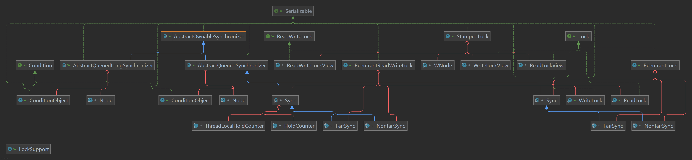

:icons: font
:doctype: book
:idprefix:
:idseparator: -
:toc: left
:toclevels: 4
:tabsize: 4
:numbered:
:sectanchors:
== 一
[qanda]
java 线程池的实现原理，threadpoolexecutor关键参数解释::
**原理**: 除 `newScheduledThreadPool` 内部实现特殊一点外(继承), 其它几个线程池都是基于 `ThreadPoolExecutor` 实现的。
+
.参数
****
* `corePoolSize` - 核心线程数，即创建的活动线程数的最大值；
* `keepAliveTime` - 没有在执行任务的线程继续存活的时间，默认情况下，当线程数大于 `corePoolSize` 开始生效计数。
* `workQueue` - 存放溢出 `corePoolSize` 后的阻塞队列，有几种实现:
** `ArrayBlockingQueue` ：基于数组结构的有界阻塞队列，按FIFO排序任务 - （ `newFixedThreadPool` ）；
** `LinkedBlockingQuene` ：基于链表结构的阻塞队列，按FIFO排序任务，吞吐量通常要高于ArrayBlockingQuene；
** `SynchronousQuene` ：一个不存储元素的阻塞队列，每个插入操作必须等到另一个线程调用移除操作，否则插入操作一直处于阻塞状  态，吞吐量通常要高于LinkedBlockingQuene；
** `priorityBlockingQuene` ：具有优先级的无界阻塞队列；
* `maximumPoolSize` - 当 `workQueue` 阻塞队列已满，允许的当前最大线程数量。
* `threadFactory` - 创建线程的工厂类，
* `handler` - 超过最大允许线程数的拒绝策略处理器
****
+
.类型
****
* `newFixedThreadPool` - 固定线程数的线程池 corePoolSize = maximumPoolSize,使用 `linkedBlockingQueue` 作为阻塞队列。不过当线程池没有任务时也不会释放线程。
* `newCachedThreadPool` - 初始化一个可以缓存线程的线程池，默认缓存60s，线程数量可达到 `Integer.MAX_VALUE` ，即2147483647，内部使用 `SynchronousQueue` 作为阻塞队列; 和 `newFixedThreadPool` 不同，当线程空闲时间超过 `keepAliveTime` 会自动释放线程资源；当提交新任务时如果没有空闲线程，则创建新线程来执行任务，会有一定的系统开销。**因此在使用该线程时，要注意并发数量，否则创建大量的线程可能导致严重的性能问题**
* `newSingleThreadExecutor` - 线程池中只有一个线程，如果线程异常结束，会重新创建一个新线程继续执行任务，唯一的线程可以保证所有提交的任务按照顺序执行，使用 `linkedBlockQueue` 作为阻塞队列。
* `newScheduledThreadPool` - 可以在指定时间内周期的执行所提交的任务，没在实际业务场景中可以使用该线程池定期的同步数据。

CAUTION: 【强制】线程池不允许使用 Executors 去创建，而是通过 ThreadPoolExecutor 的方式，这样的处理方式让写的同学更加明确线程池的运行规则，规避资源耗尽的风险。

[NOTE]
.Executors 返回的线程池对象的弊端如下：
====
. `FixedThreadPool` 和 `SingleThreadPool` :允许的请求队列长度为 `Integer.MAX_VALUE`，可能会堆积大量的请求，从而导致 `OOM` 。
. `CachedThreadPool` 和 `ScheduledThreadPool` :允许的创建线程数量为 `Integer.MAX_VALUE`，可能会创建大量的线程，从而导致 `OOM` 。
====
****

hashmap的原理，容量为什么是2的幂次::
+
.原理
****
. HashMap是基于哈希表的Map接口的非同步实现。此实现提供所有可选的映射操作，并允许使用null值和null键。此类不保证映射的顺序，特别是它不保证该顺序恒久不变。
. 在java编程语言中，最基本的结构就是两种，一个是数组，另外一个是模拟指针（引用），所有的数据结构都可以用这两个基本结构来构造的，HashMap也不例外。HashMap实际上是一个“链表散列”的数据结构，即数组和链表的结合体。
. HashMap的存取：
.. 利用key的hashCode重新hash计算出当前对象的元素在数组中的下标（索引计算公式：（length-1）& hash）；
.. 存储时，如果出现hash值相同的key，此时有两种情况。(1)如果key相同，则覆盖原始值；(2)如果key不同（出现冲突），则将当前的key-value放入链表中
.. 获取时，直接找到hash值对应的下标，在进一步判断key是否相同，从而找到对应值。
.. 理解了以上过程就不难明白HashMap是如何解决hash冲突的问题，核心就是使用了数组的存储方式，然后将冲突的key的对象放入链表中，一旦发现冲突就在链表中做进一步的对比。

[NOTE]
====
. 使用一个Node数组来存储数据，但这个Node可能是链表结构，也可能是红黑树结构 如果插入的key的hashcode相同，那么这些key也会被定位到Node数组的同一个格子里。
. 如果同一个格子里的key不超过8个，使用链表结构存储。
. 如果超过了8个，那么会调用treeifyBin函数，将链表转换为红黑树。
. 那么即使hashcode完全相同，由于红黑树的特定，查找某个特定元素，也只需要O(log n)的开销
. 也就是说put/get的操作的时间复杂度只有O(log n)
====
****
+
.扩容
****
当hashmap中的元素越来越多的时候，碰撞的几率也就越来越高（因为数组的长度是固定的），所以为了提高查询的效率，就要对hashmap的数组进行扩容，数组扩容这个操作也会出现在ArrayList中，所以这是一个通用的操作，很多人对它的性能表示过怀疑，不过想想我们的“均摊”原理，就释然了，而在hashmap数组扩容之后，最消耗性能的点就出现了：原数组中的数据必须重新计算其在新数组中的位置，并放进去，这就是resize。

那么hashmap什么时候进行扩容呢？当hashmap中的元素个数超过数组大小*loadFactor时，就会进行数组扩容，loadFactor的默认值为0.75，也就是说，默认情况下，数组大小为16，那么当hashmap中元素个数超过16*0.75=12的时候，就把数组的大小扩展为2*16=32，即扩大一倍，然后重新计算每个元素在数组中的位置，而这是一个非常消耗性能的操作，所以如果我们已经预知hashmap中元素的个数，那么预设元素的个数能够有效的提高hashmap的性能。比如说，我们有1000个元素new HashMap(1000), 但是理论上来讲new HashMap(1024)更合适，不过即使是1000，hashmap也自动会将其设置为1024。 但是new HashMap(1024)还不是更合适的，因为0.75*1000 < 1000, 也就是说为了让0.75 * size > 1000, 我们必须这样new HashMap(2048)才最合适，既考虑了&的问题，也避免了resize的问题。
****
+
.容量是2的次幂
****
* 元素在数组中的计算索引为 `(capicity -1/& keyHash`;
* 不是 2的次幂的容量容易造成空间浪费，加大hash冲突；
* 2的次幂的容量在计算元素index时有效的利用了数组空间，减少了hash冲突，提高了集合性能。
****

为什么要同时重写hashcode和equals::
. 不写将使用原生Object 类的方法。Object#hashcode 返回内存地址，equal 单纯的比较 两个对象是否同一个；
. 重写后，可以根据业务扩展。
+
[NOTE]
====
. 两个对象相等，hashCode 值必定相等;
. hash值相等，对象不一定相等。
. 对于不相等的对象产生截然不同的hash值，有可能提高散列表（hash table）的性能。
. 重写时，两个方法必须同时重写。
====

ConcurrentHashMap如何实现线程安全？::
在并发编程中使用HashMap可能导致程序死循环。而使用线程安全的HashTable效率又非常低下，基于以上两个原因，便有了ConcurrentHashMap的登场机会
+
. 它使用 cas-Compare And Swap
. 初始化数据结构时的线程安全。node对象数组存放放数据，hash冲突时形成链表，链表长度超过8，node数组超过64时会将链表结果转换为红黑树。
+
NOTE: value 和next指针使用了 `volatile` 保证了其可见性。jdk8 在第一次put方法时才会调用初始化方法。
+
. 多个线程同时进行put操作，初始化数组时使用了乐观锁CAS进行了初始化，只有一个线程能够初始化成功；
+
TIP: 由于CAS操作属于乐观派，它总认为自己可以成功完成操作，当多个线程同时使用CAS操作一个变量时，只有一个会胜出，并成功更新，其余均会失败，但失败的线程并不会被挂起，仅是被告知失败，并且允许再次尝试，当然也允许失败的线程放弃操作，这点从图中也可以看出来。基于这样的原理，CAS操作即使没有锁，同样知道其他线程对共享资源操作影响，并执行相应的处理措施。同时从这点也可以看出，**由于无锁操作中没有锁的存在，因此不可能出现死锁的情况，也就是说无锁操作天生免疫死锁** 。
+
. hash完美不冲突的情况下，可同时支持n个线程度线程安全的同时put操作，默认大小n=16。
. hash 冲突严重时，node链表越来越长，导致严重的锁竞争，此时会进行扩容，将node进行再散列。

Redis缓存雪崩、穿透、击穿概念及解决办法::
+
.雪崩
****
缓存雪崩是指**大量缓存数据同时过期**或缓存服务宕机，突然对这些数据的所有搜索都会命中DB，导致DB层负载高，影响性能的场景。

方案::
* 宕机 - 最强雪崩，key同时失效
. redis 高可用，主从+哨兵（多主+多从），避免全部崩盘；
. 直接返回缓存异常，不再访问数据库，这样对服务打击最大，但对数据库的保护是有效的
. 本地单机 ehcache 缓存 + hystrix 限流&降级；
. 雪崩前 缓存策略，例如 缓存承载90%，数据库 10%，这样既保证了数据库的安全又防止了业务的不可用（部分可用）。
. redis 持久化，一旦redis 重启，自动从磁盘加载数据，快速回复缓存。
* 大量key同时过期
. 调整不同key过期时间，让他么不会同时过期,你可以在过期时间后添加一个随机时间，比如（1-3分钟）。这样既保证了业务基本同时到期，也不会同时到期。；
. 配置其它策略，例如 hystric,降级 或者 限速，以便底层系统依然可以使用，避免高负载。非核心数据直接返回指定的静态数据（缓存中没有或没有数据库请求）。只有核心数据持续访问缓存（如果没有缓存，也可以访问数据库。由于非核心数据请求的限制，此时DB的压力应该很小）
****
+
.穿透
****
大量的数据查询，缓存查不到，数据库查不到，也不会缓存，造成频繁数据库查询。

方案::
. 如果DB中没有key的数据，只返回一个空结果并缓存一小段时间（不要设置很长的过期时间）
. 使用布隆过滤器。布隆过滤器类似于 hbase 集，可用于检查数据集中是否存在键。如果key存在就去缓存层或者DB层，如果数据集中不存在就返回。
****
+
.击穿
****
key 非常热点，大量请求高并发，当该key 处于过期瞬间(**单个热点key**，不同于雪崩多个)，大量的请求击穿缓存，直接查询数据库，

方案::
. 通过工作线程异步更新缓存的数据，使热点数据永不过期
. 基于redis 实现互斥锁，等大量并发请求中的第一个请求构建完成缓存后再释放锁，此时并发的其它请求查询的就是缓存数据了
****

redis 持久化方案::
+
.RDB
****
每隔一段时间，把内存中的数据写到磁盘的临时文件中，作为快照，回复的时候再把快照写到内存。

优势::
. 每隔一段时间全量备份（1小时、24小时、30天）；
. 灾备简单，可以远程传输；
. 子进程备份的时候，主进程不会有任何 io 操作，保存数据的完整性；
. 文件小，相对 `AOF`来说，当有更大文件时，可以快速重启恢复。
劣势::
. 发生故障时，有可能丢失最后一次的备份数据；
. 子进程占用的内存和父进程一样，如此会造成cpu负担；
. 定时备份数据全量重量级备份，对于实时备份，无法处理。
****
+
TIP: 可以在配置文件中配置备份策略。RDB 适合大量数据恢复，数据完整性和一致性不足。
+
.AOF
****
. 日志形式记录用户请求的写操作，读操作不会记录。
. 文件以追加形式-增量；
. aof 恢复其实就是将追加的文件从开始到结尾写入内存恢复。

优势::
. 更加耐用，秒级备份，发生问题只会丢弃最后一秒的数据，大大增强可靠性和完整性；
. log 形式追加，磁盘满了，执行 redis-check-aof
. 数据太大，redis在后台自动重写 aof。不会影响客户端的读写操作。
劣势::
. size 比RDB大；
. aof 比RDB慢
****
+
.RDB+AOFl联合实现冷热备份
****
RDB冷备，AOF热备，故障后，优先加载AOF，其次RDB
****

绍Java多线程的5大状态，以及状态图流转过程::
+
.状态
****
新建（new），可运行（runnable），运行（running），阻塞（blocked），死亡（dead）；

阻塞三种情况::
. 等待阻塞 - 执行wait(),jvm将其放入等待队列（waiting queue）中；
. 同步阻塞 - 获取同步锁时，同步锁被其它线程占用，jvm将其放入锁池（lock pool）中；
. 其它阻塞 - 运行sleep(long ms) 或者 join（）或者发布io请求，jvm会将该线程置为阻塞状态，当sleep 超市，join 等待线程种植或者超时，io处理完毕，线程将转入 runnable 状态；
****
+
.流转
****
. 新建线程；
. 可运行状态；
. 运行状态；
.. sleep,join, io输入  -> sleep 结束，join线程终止，io输入结束 -> 可运行状态；
.. 同步锁synchronized -> 锁池队列 -> 拿到对象锁 -> 可运行；
.. wait(), -> 等待队列 -> notify,notifyAll 唤醒 -> 锁池队列 -> 拿到对象锁 -> 可运行；
. 死亡状态。
****

介绍下Synchronized、Volatile、CAS、AQS，以及各自的使用场景::
+

+

+
.概念
****
java 并发锁常用的有两种锁::
* 隐式锁： `synchronized` 关键字；
* 显示锁： `Lock` 和 `RenetrantLock` 两个接口,对应的实现类包含 `ReentrantLock` 和 `ReentrantReadWriteLock`, 这两个类都是基于 `AQS` 实现。
+
NOTE: 还有的地方 `CAS` 也被称为一种锁，在 `AQS` 在内的很多并发类中， `CAS` 扮演了重要角色。
+
悲观锁-乐观锁::
* 悲观锁=独占锁 - 他假设一定会发生冲突，获取到锁后吗，阻塞其它线程。好处是简单，安全，但开销大。 典型代表： `synchronized`.但大部分时候都不会发生冲突，这样会造成极大的性能浪费。
* 乐观锁 - 它假设不会发送冲突，先去尝试执行，失败了再进行其它处理（不断循环重试），这种锁不会阻塞其它线程，也不涉及上下文切换，性能开销小。代表: `CAS`.
+
公平锁和非公平锁::
* 公平锁是指各个线程在加锁前先检查有无排队的线程，按排队顺序去获得锁。
* 非公平锁是指线程加锁前不考虑排队问题，直接尝试获取锁，获取不到再去队尾排队。值得注意的是，在 AQS 的实现中，一旦线程进入排队队列，即使是非公平锁，线程也得乖乖排队。
+
可重入锁和不可重入锁::
* 可重入 - 一个线程获取到锁，那么这个线程可访问这个线程 锁住的所有代码；
* 不可重入 - 和以上相反

****
+
.synchronized
****
* 属于杜占锁。
* 修改静态方法时，锁类对象（Object.class）.
* 非静态方法时，锁对象（this）
* **多个线程可以同时访问同一个 `synchronize`，只要他们访问的对象是不同的实例**

实现原理::
基于java对象头和monitor机制。
+
NOTE: 一个java对象在内存中包含三个部分：对象头，实例数据，对其填充。
+
对象头:::
** class metadata address（类型指针）：存储类的元数据的指针。jvm通过这个指针找到是哪个类的实例。
** mark word（标记字段）：存储一些对象自身运行是数据。包括哈希码，gc分代年龄，锁状态标志等。
Monitor:::
mark word 中有一个字段指向Monitor对象。 每个对象都有一个锁和等待队列，在这里实现。monitor对象由c++实现，有以下三个关键字段：
** `_owner` - 记录当前持有锁的线程
** `_EntryList` - 队列，记录所有阻塞等待锁的线程；
** `_WaitSet` - 队列，记录调用 `wait()` 未被唤醒的线程。
+
执行机制如下::::
. 多个线程竞争锁时，会进入 `_EntryList` 队列，成功的线程标记为 `Owner`.
. 如果 `Owner` 线程调用 `wait()` 方法 -> 释放对象锁 -> `_WaitSet`-> 其它线程竞争锁；
. `Owner` 线程执行玩，释放锁，其它线程竞争
+
JVM 对synchronize处理::
** 如果同步的是代码块，编译会直接在代码块前加上 `monitorenter` 指令，后面加上 `monitorexit` 指令
** 如果是同步方法，jvm 会为方法设置 `ACC_SYNCHRONIZED` 标志，根据次标识判断是否同步方法。
+
JVM 对 `synchronized` 优化::
`synchronized` 是重量级锁，由于消耗太大，jvm对其进行了优化。
** 锁消除 - jvm运行时发现一段被锁住的代码**不可能**存在共享数据时，会将这个锁清除。
** 自旋锁和自适应锁 -
****

B+树和红黑树时间复杂度::
ss

如果频繁老年代回收怎么分析解决::
ss

JVM内存模型，新生代和老年的回收机制::
ss

mysql limit分页如何保证可靠性::
ss

==  二

[qanda]
java nio，bio，aio，操作系统底层nio实现原理::
ssss

Spring IOC，autowired如何实现::
ssss

Spring事务传播机制::
ssss

线程死锁排查::
ssss

MySQL引擎及区别，项目用的哪个，为什么::
ssss

RPC为什么用http做通信？::
ssss

RPC两端如何进行负载均衡？::
ssss

mycat分库分表、读写分离的实现::
ssss

分布式数据如何保证数据一致性::
ssss

 高并发请求处理，流量削峰措施有哪些::
ssss

== 三
[qanda]
谈谈你参与过的最有挑战的技术项目::
ssss

Redis持久化RDB和AOF 的区别::
ssss

MQ底层实现原理::
ssss

详细介绍下分布式 一致性Hash算法::
ssss

nginx负载均衡的算法::
ssss

Nginx 的 upstream目前支持 哪4 种方式的分配::
ssss

分布式集群部署后，从应用端哪些需要怎么调整::
ssss

Dubbo默认使用什么注册中心，还有别的选择吗？::
ssss

mongoDB、redis和memcached的应用场景，各自优势::
ssss

 谈谈你性能优化的实践案例，优化思路？::
ssss

 两千万用户并发抢购，你怎么来设计？::
ssss

== 四

你觉得你有什么优点？有什么缺点？分别举例讲一讲。你怎么克服缺点？::
ssss

你觉得最有成就感的一件事是什么，你遇到了什么问题，怎么解决的？::
ssss

工作中如果遇见了技术问题，暂时你无法解决，你的应对思路？::
ssss

如果有一家公司给到你的薪资比阿里更高，你怎么选择，为什么这样选？::
ssss

谈谈未来3年你的职业规划？::
ssss

