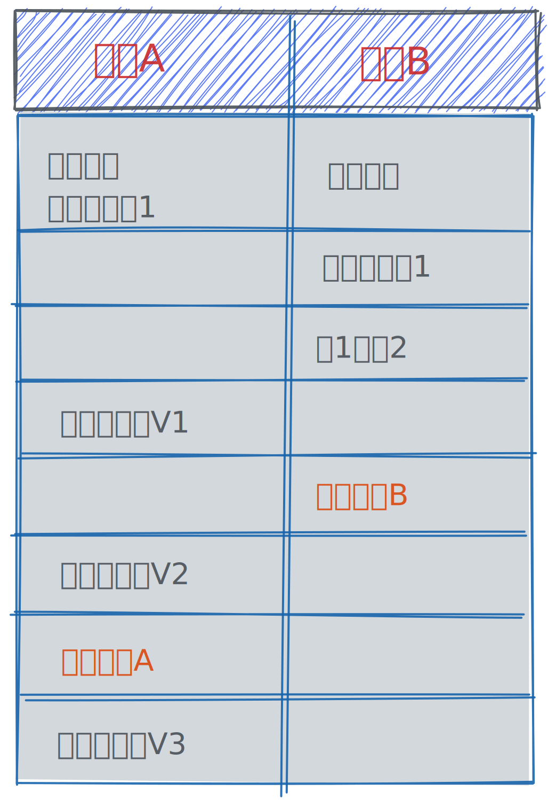

== 事务简介
事务就是为了保证一组数据库操作，要么全部成功，要么全部失败。

事务是在引擎层实现的，也就是说并不是所有引擎都可以使用事务，MyISAM 就不支持事务，这也是为什么会被 InnoDB 取代的原因。

说到事务，就不得不说 ACID 特性（Atomicity、Consistency、Isolation、Durability，即原子性、一致性、隔离性、持久性）。

== ACID 特性
原子性（Atomicity）::
一个事务中的多组操作，要么全部成功，要么全部失败。在事务提交（commit）成功之后，所有的操作都生效，提交失败，所有的操作都会回滚。

一致性（Consistency）::
一个事务执行之前和执行之后数据库都必须处于一致性状态。在事务执行的过程中，只要事务未提交，就不会改变数据库的状态。提交之后事务已完成，此时数据库状态发生变化。

隔离性（Isolation）::
事务在执行过程中，是与外界完全隔离的，即使数据库发生了变更，事务中也获取不到。A 事务对数据库做的变更，在事务未提交之间，数据库中也看不到，B 事务中也看不到。

持久性（Durability）::
事务一旦提交，对数据库的变更就会持久化到磁盘，即使数据库发生异常重启，数据也不会丢失。

== 隔离级别
当数据库出现有多个事务同时执行时，就可能出现脏读，幻读，不可重复读等问题，隔离级别就是为了解决这些问题的。隔离的越严实，效率就越低，并发越低，安全性越高。

隔离级别分为以下 4 种::
. 读未提交（read uncommitted，RU） 一个事务还未提交时，它做的变更就可以被别的事务看到。
. 读提交（read committed，RC） 事务提交以后，它做的变更才能被其它事务看到。但是在这个事务未提交之前，数据库中发生的变更，这个事务也能看见。
. 可重复度（repeatable read，RR） 事务总是只能看见在启动的那个时刻，数据库的状态。事务未提交之前做的变更，其它事务看不见。事务执行期间，数据库中已经发生的变更，这个事务也看不见。只能看见事务刚启动时刻，数据库的状态。
. 串行化（serializable） 事务对某一行的操作会加锁，“写”会加“写锁”，“读”会加“读锁”，在锁释放掉之前，其它的事务都无法都这一行的记录进行操作。必须等之前的事务执行完毕，释放锁。后面的事务又会重新加锁。

我们通过一个例子来说明一下四种隔离级别具体是怎么体现的。

给出一个建表语句：
[source, shell script]
----
mysql> create table T(c int) engine=InnoDB;
mysql> insert into T(c) values(1);
----
假设有以下两个事务，其中执行的操作如图，从上至下是时间先后顺序：

在四种不同的隔离级别下，V1、V2、V3的值分别为多少呢？我们现在分析一下::

. 读未提交 - [red]#事务还未提交，做的变更就能被其它事务看见#，因此事务 B 修改了值为 2 ，事务 A 可以直接看见。所以 V1 = 2，V2 = 2，V3 = 2。
. 读提交（RC） [red]#事务在提交之前，做的变更都无法被其它事务看见#，但是事务本身可以看到数据库的变更。 因此，事务 B 做了修改以后，事务 A 无法立刻看见，V1 = 1，事务 B 提交以后，事务 A 就可以看到数据库的变更了，因此 V2 = 2，V3 = 2。
. 可重复读（RR） [red]#事务总是只能看到在启动的那个时刻，数据库的状态，即在事务未提交之前，自己做的变更别的事务看不见，数据库中的变更自己也看不见。# 因此，事务 B 提交之前，A 看不见 B 做的变更，V1 = 1，事务 B 提交以后，数据库的值虽然发生了变更，但是事务 A 还未提交，A 还是只能看到自己在启动时刻，数据库的值（可以理解为数据库有版本，只能看见历史版本）。因此，V2 = 1，事务 A 提交以后，就可以看到数据库的变更了，因此 V3 = 2。
. 串行化 [red]#事务在操作某一行记录时会加锁，“读”会加“读锁”，“写”会加“写锁”。# 事务 A 在启动后，先执行了 1 条查询语句，对这行数据加了“读锁”，这个“读锁”要等事务 A 提交以后，才会释放。因此事务 B 执行查询语句会处于等待锁释放状态。这时候事务 B 会一直等待。因此，V1 = 1，V2 = 1，事务 A 提交之后，“读锁”释放，事务 B 获取该行记录的“读锁”，并更新了数据（又加了一个“写锁”），事务 B 未提交之前，A 再去查数据也需要等待锁释放，事务 B 提交以后，锁释放，A 拿到锁，开始查询数据，因此，V3 = 2。

以上是如何实现的呢？

== 事务隔离的实现原理
数据库中会创建一个视图 readView::
* 在“可重复读”隔离级别下，这个视图是在事务启动时创建的，整个事务存在期间都用这个视图。
* 在“读提交”隔离级别下，这个视图是在每个 SQL 语句开始执行的时候创建的。这里需要注意的是，“读未提交”隔离级别下直接返回记录上的最新值，没有视图概念；
* 而“串行化”隔离级别下直接用加锁的方式来避免并行访问。

在 MySQL 中，实际上每条记录在更新的时候都会同时记录一条回滚操作。记录上的最新值，通过回滚操作，都可以得到前一个状态的值。同一条记录在系统中可以存在多个版本，就是数据库的多版本并发控制（MVCC）。

回滚日志什么时候删除呢?::
系统中没有比这个回滚日志更早的 read-view 时，这个回日志就会被删除。
因此不建议使用长事务，容易导致回滚日志太多，大量占用存储空间。

== 事务的启动方式
显式启动：begin 或 start transaction。配套的提交语句是 commit，回滚语句是 rollback。
也可以使用 set autocommit=0，此时不需要显式启动，比如执行了一个select语句就直接启动了事务，但是需要再执行一条commit来提交；
因此建议设置set autocommit=1，此时需要用begin来开启事务，如果觉得多了一次交互，比较麻烦的话，也可以使用commit work and chain，表示提交当前事务，并且再启动一个新的事务，这样就只有一次begin了。

== next-key lock
https://www.cnblogs.com/linyihai/p/15057870.html

https://www.cnblogs.com/zhoujinyi/p/3435982.html