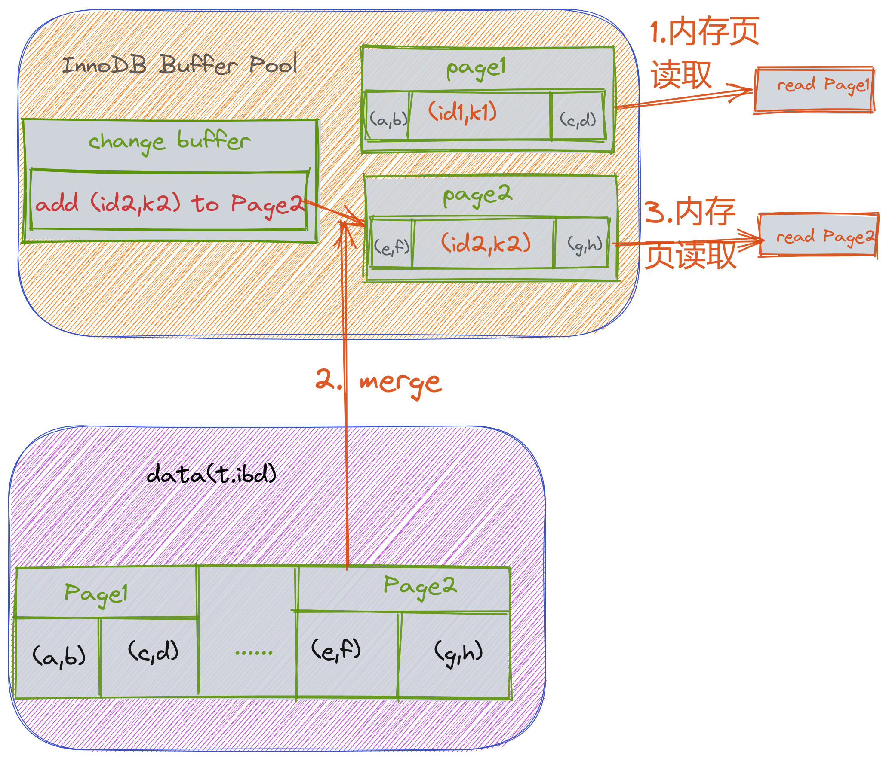

:origin-page: https://www.fatalerrors.org/a/from-the-basis-to-the-principle-of-mysql-index-this-article-is-enough.html

= 索引原理

[plantuml,format=png]
....
include::index-mind_map.puml[]
....

== 区别

普通索引和唯一索引的区别::
这两类索引在查询能力上是没差别的，主要考虑的是对更新性能的影响。建议尽量选择普通索引。
+
检索:::
* 普通索引在找到满足条件的记录后，需要查询下一个记录，直到遇到第一个不满足条件的记录为止；
* 唯一索引查到第一个满足条件的记录，即终止检索；
+
NOTE: 普通索引会多检索一次，几乎没有影响。因为InnoDB 的数据是按照数据页为单位进行读取的，需要读取数据时，并不是直接从磁盘读取记录，而是先把数据页读到内存，再去数据页检索。一个数据页默认16k对于整型字段，一个可以存放近千个key，除非读取数据在数据页的最后一条记录，就需要再读一个数据页，这种情况很少，对cpu的消耗基本可以忽略。
+
**因此说，在查询数据方面，普通索引和唯一索引没差别。**

更新:::
更新操作并不是直接对磁盘中的数据进行更新，是**先把数据页从磁盘读入内存，再更新数据页。**
* 普通索引 - 将数据页从磁盘读入内存,更新数据页；
* 唯一索引 - 将数据页从磁盘读入内存，判断是否唯一，再更新数据页；
+
由于mysql 有 `change buffer` 机制，导致两种索引在更新上有一定的区别。
+
`change buffer` 的作用是为了降低 IO 操作，避免系统负载过高。 change buffer 将数据写入数据页的过程叫做 `merge`.
+
更新步骤::::
. 如果需要更新的数据页在内存中，会直接更新内存页；
. 如果数据页不再内存中，会将更新操作记入 change buffer， 下一次读取数据页时，merge 到数据页中；
.. change buffer 有定期的merge 策略；
.. 数据库正常关闭也会触发 merge；
. 唯一索引 - 更新前需要判断数据是否唯一，如果数据页在内存中，就直接判断并更新，如果不在，需要从磁盘读出来，判断唯一。change buffer 用不到
+
NOTE: change buffer 用的是 buffer pool里的内存，因此不能无限增大，change buffer 大小可通过 `innodb_change_buffer_max_size` 来动态设置。这个参数设置为50的时候，表示change buffer 只能用到 buffer pool 的 50%。
+
IMPORTANT: 唯一索引用不了 change buffer ，只有 普通索引可以使用。

change buffer 和 redo log 的区别::
change buffer 的作用是降低更新操作的频率，缓存更新操作。这样有一个缺点： **更新不及时，对于读操作比较频繁的表，不建议使用 change buffer**
+
由于更新操作刚记录到change buffer 中，就读取了该表，数据页读取到了内存中，数据马上就merge 到数据页中了。这样不仅不会降低性能消耗，反而会增加维护change buffer 的成本。
+
TIP: *change buffer 适用写多读少的表*
+
添加数据:::
+
[source,mysql]
.添加数据
----
mysql> insert into t(id,k) values(id1,k1),(id2,k2);
----
假设， （id1，k1） 在数据页Page1 中， （id2， k2） 在Page2中，并且 Page1在内存，Page2不在。
+
执行过程::::
. 直接向Page1 写入 （id1， k1）；
. 在change buffer 中记下向 Page2 写入（k2, v2）;
. 将以上两个动作记入 redo log；
+
做完以上，事物就完成了。执行成本很低: 两次内存写入，一次磁盘写入（两次操作合在一起写了一次磁盘，而且还是顺序写的）；
+
这条更新语句设计四个部分：内存， redo log（ib_log_fileX）, 数据表空间（t.ibd），系统表空间（ibdata1）。

image::images/update-redo.png[]

读取数据:::
+
[source,shell script]
----
mysql> select * from t where k in (k1, k2);
----
+
接上面例子，假设 读操作在更新后不久，此时内存中还有Page1，没有Page2。那么读操作就和 redo log 以及 ibdata1 无关了。
+
. 从内存中获取到Page1的最新数据（id1，k1）；
. 将数据页Page2 读入内存，执行merge 操作，此时内存中的Page2 也有最新数据了
+

需要注意的是:::
. redo log 中的数据吗，可能还没有flush 到磁盘，磁盘中的Page1 和 Page2 并没有最新数据，但我们依然可以拿到最新数据（内存中的Page1 就是最新的，Page2虽然不是最新的，但是通过脱merge 操作后就是最新的）；
. 如果此时mysql宕机了，change buffer 中的数据会不会丢失呢？
+
change buffer 中的数据分为两部分。一部分是已经merge 到 ibdata1 中的数据，这部分数据已经持久化，不会丢失。另一部分，还在 change buffer 中，分三种情况
+
.. change buffer 写入数据到内存，redo log 也已经写入（ib-log-fileX）,但是未 commit，binglog也没有 fsync 到磁盘，这部分数据会丢失；
.. change buffer 写入数据到内存，redo log 也已经写入（ib-log-fileX）,但是未 commit，binglog已写入到磁盘，这部分数据不会丢失很多，异常重启后，会先从 binlog 恢复 redo log，再从 redo log 恢复 change buffer；
.. change buffer 写入数据到内存， redo log 和 binlog 都已经 fsync，直接从 redo log 恢复，不会丢失。
+
NOTE: redo log 主要节省的是随机写磁盘的IO 消耗（转成顺序写）， 而change buffer 主要节省的是 随机读磁盘的 IO 消耗。