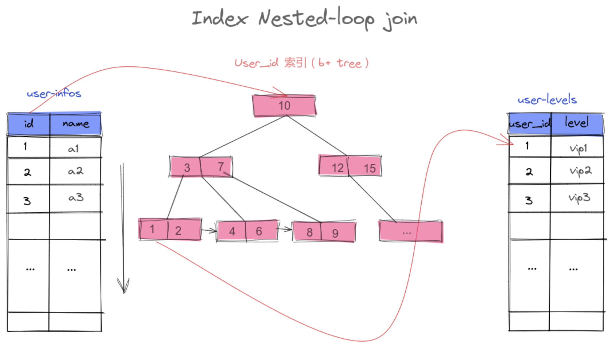

= join原理(算法)

== Simple Nested-Loop Join（简单的嵌套循环连接）

简单来说嵌套循环连接算法就是一个双层for 循环 ，通过循环外层表的行数据，逐个与内层表的所有行数据进行比较来获取结果，当执行 `select * from user tb1 left join level tb2 on tb1.id=tb2.user_id`

时，我们会按类似下面代码的思路进行数据匹配：
[source, java]
----
for(user表的一行 ： user表){
    for(level表的一行： level表){
        if(level.user_id == user.id){
            ...
        }
    }
}
----
整个匹配过程会如下图：

////
// 需要设置 KROKI_MAX_URI_LENGTH   环境变量-kroki服务器 - https://docs.kroki.io/kroki/setup/configuration/
:KROKI_MAX_URI_LENGTH: 64000
.excalidraw example
[excalidraw]
....
include::images/excaldraw/snlj.json[]
....
////

特点::
. Nested-Loop Join 简单粗暴容易理解，就是通过双层循环比较数据来获得结果，但是这种算法显然太过于粗鲁，如果每个表有1万条数据，那么对数据比较的次数=1万 * 1万 =1亿次，很显然这种查询效率会非常慢。
. 当然mysql 肯定不会这么粗暴的去进行表的连接，所以就出现了后面的两种对Nested-Loop Join 优化算法，在执行join 查询时mysql 会根据情况选择 后面的两种优join优化算法的一种进行join查询。

== Index Nested-Loop Join（索引嵌套循环连接）
Index Nested-Loop Join其优化的思路 主要是为了减少内层表数据的匹配次数， 简单来说Index Nested-Loop Join 就是通过外层表匹配条件 直接与内层表索引进行匹配，避免和内层表的每条记录去进行比较， 这样极大的减少了对内层表的匹配次数，从原来的匹配次数=外层表行数 * 内层表行数,变成了 外层表的行数 * 内层表索引的高度，极大的提升了 join的性能。

案例::
如SQL： `select * from user tb1 left join level tb2 on tb1.id=tb2.user_id`

当level 表的 user_id 为索引的时候执行过程会如下图：

NOTE: 使用Index Nested-Loop Join 算法的前提是匹配的字段必须建立了索引。

== Block Nested-Loop Join（缓存块嵌套循环连接）

Block Nested-Loop Join 其优化思路是减少内层表的扫表次数，通过简单的嵌套循环查询的图，我们可以看到，左表的每一条记录都会对右表进行一次扫表，扫表的过程其实也就是从内存读取数据的过程，那么这个过程其实是比较消耗性能的。

所以缓存块嵌套循环连接算法意在通过一次性缓存外层表的多条数据，以此来减少内层表的扫表次数，从而达到提升性能的目的。如果无法使用Index Nested-Loop Join的时候，数据库是默认使用的是Block Nested-Loop Join算法的。

当level 表的 user_id 不为索引的时候，默认会使用Block Nested-Loop Join算法，匹配的过程类似下图。

[NOTE]
====

. 使用Block Nested-Loop Join 算法需要开启优化器管理配置的optimizer_switch的设置block_nested_loop为on 默认为开启，如果关闭则使用Simple Nested-Loop Join 算法；
** 通过指令：Show variables like 'optimizer_switc%'; 查看配置
. 设置join buffer 的大小
** 通过join_buffer_size参数可设置join buffer的大小
** 指令：Show variables like 'join_buffer_size%';

====

== Join 算法总结

不论是Index Nested-Loop Join 还是 Block Nested-Loop Join 都是在Simple Nested-Loop Join的算法的基础上进行优化，这里 Index Nested-Loop Join 和Nested-Loop Join 算法是分别对Join过程中循环匹配次数和IO 次数两个角度进行优化。

Index Nested-Loop Join 是通过索引的机制减少内层表的循环匹配次数达到优化效果，而Block Nested-Loop Join 是通过一次缓存多条数据批量匹配的方式来减少外层表的IO次数,同时也减少了内层表的扫表次数.

通过 理解join 的算法原理我们可以得出以下表连接查询的优化思路::
. 永远用小结果集驱动大结果集(其本质就是减少外层循环的数据数量)
. 为匹配的条件增加索引(减少内层表的循环匹配次数)
. 增大join buffer size的大小（一次缓存的数据越多，那么内层包的扫表次数就越少）
. 减少不必要的字段查询（字段越少，join buffer 所缓存的数据就越多）
