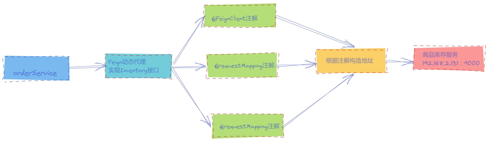
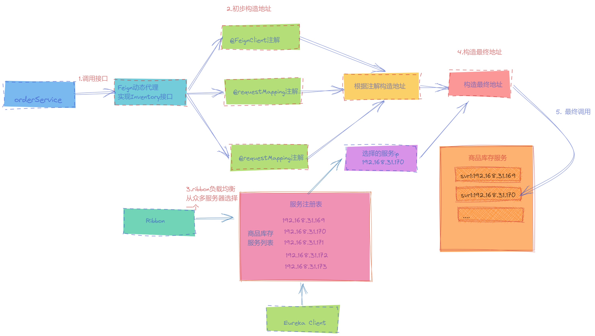

= Spring Cloud核心组件：Ribbon，Feign

Ribbon是什么？::
* Ribbon是Netflix发布的开源项目，主要功能是提供客户端的软件负载均衡算法
* Ribbon客户端组件提供一系列完善的配置项，如连接超时，重试等。简单的说，就是在配置文件中列出后面所有的机器，Ribbon会自动的帮助你基于某种规则（如简单轮询，随即连接等默认轮询的方式）去连接这些机器。我们也很容易使用Ribbon实现自定义的负载均衡算法。

Ribbon提供负载均衡算法有如下几种::

[plantuml,format=png]
....
@startmindmap
* IRule
** RoundRobinRule
***_ 轮询
** RandomRule
***_ 随机
** AvailabilityFilteringRule
***_ 过滤多次故障跳闸的服务
***_ 并发数量超过阈的服务
***_ 对剩余服务进行轮询
** WeightedResponseTimeRule
***_ 根据平均响应时间计算服务权重，越快权重越大；
***_ 刚启动信息不足，使用Random策略；
** RetryRule
***_ 1. 现根据 RoundRobinRule 获取服务；
***_ 2. 失败在指定时间重试，再次失败则放弃；
** BestAvailableRule
***_ 过滤掉多次故障服务，选择一个并发量最小的
** ZoneAvoidanceRule
***_ 默认规则，多种条件判断server 所在区域的性能和可用性；
***_ ZoneAvoidancePredicate - 首先判断 server 性能是否可用；
***_ AvailabilityPredicate - 然后判断 server 并发过多的；
@endmindmap
....

负载均衡::
负载均衡是网络压力，和缓解处理能力扩容的重要手段之一 负载均衡算法
+
负载均衡分为硬件负载均衡和软件负载均衡:::
* 硬件负载均衡：主要是在服务器端，服务器几个节点之间安装专门用于负载均衡的设备比如F5
* 软件负载均衡：比如Nginx

==  实现原理
维护了一个被@LoadBalanced注解注释的RestTemplate对象列表，并在LoadBalancerAutoConfiguration
进行初始化，通过调用RestTemplateCustomizer 的实例来给需要客户端负载均衡的RestTemplate增加
LoadBalancerInterceptor 拦截器。 通过线性负载均衡规则

具体的负载均衡算法可以参考 AbstractLoadBalancerRule 实现类::

[source,java]
----
@Configuration(
proxyBeanMethods = false
)
@ConditionalOnClass({RestTemplate.class})
@ConditionalOnBean({LoadBalancerClient.class})
@EnableConfigurationProperties({LoadBalancerProperties.class})
public class LoadBalancerAutoConfiguration {

  @Configuration(
        proxyBeanMethods = false
    )
    @Conditional({LoadBalancerAutoConfiguration.RetryMissingOrDisabledCondition.class})
    static class LoadBalancerInterceptorConfig {
        LoadBalancerInterceptorConfig() {
        }

        @Bean
        public LoadBalancerInterceptor loadBalancerInterceptor(LoadBalancerClient loadBalancerClient, LoadBalancerRequestFactory requestFactory) {
            return new LoadBalancerInterceptor(loadBalancerClient, requestFactory);
        }

        @Bean
        @ConditionalOnMissingBean
        public RestTemplateCustomizer restTemplateCustomizer(final LoadBalancerInterceptor loadBalancerInterceptor) {
            return (restTemplate) -> {
                List<ClientHttpRequestInterceptor> list = new ArrayList(restTemplate.getInterceptors());
           //restTemplate 添加拦截器
                list.add(loadBalancerInterceptor);
                restTemplate.setInterceptors(list);
            };
        }
    }
}
----
[source,java]
----
//1 为resttemplate 注入拦截器
//2 执行拦截器 LoadBalancerInterceptor
 public ClientHttpResponse intercept(final HttpRequest request, final byte[] body, final ClientHttpRequestExecution execution) throws IOException {
        URI originalUri = request.getURI();
        String serviceName = originalUri.getHost();
        Assert.state(serviceName != null, "Request URI does not contain a valid hostname: " + originalUri);
        return (ClientHttpResponse)this.loadBalancer.execute(serviceName, this.requestFactory.createRequest(request, body, execution));
    }
//RibbonLoadBalancerClient
 public <T> T execute(String serviceId, LoadBalancerRequest<T> request, Object hint) throws IOException {
        ILoadBalancer loadBalancer = this.getLoadBalancer(serviceId);
//通过负载均衡算法获取服务器地址，进行调用
        Server server = this.getServer(loadBalancer, hint);
        if (server == null) {
            throw new IllegalStateException("No instances available for " + serviceId);
        } else {
            RibbonLoadBalancerClient.RibbonServer ribbonServer = new RibbonLoadBalancerClient.RibbonServer(serviceId, server, this.isSecure(server, serviceId), this.serverIntrospector(serviceId).getMetadata(server));
            return this.execute(serviceId, (ServiceInstance)ribbonServer, (LoadBalancerRequest)request);
        }
    }

 protected Server getServer(ILoadBalancer loadBalancer, Object hint) {
        return loadBalancer == null ? null : loadBalancer.chooseServer(hint != null ? hint : "default");
    }
----

[source,java]
----
public Server choose(ILoadBalancer lb, Object key) {
if (lb == null) {
log.warn("no load balancer");
return null;
} else {
Server server = null;
int count = 0;

            while(true) {
                if (server == null && count++ < 10) {
                    List<Server> reachableServers = lb.getReachableServers();
                    List<Server> allServers = lb.getAllServers();
                    int upCount = reachableServers.size();
                    int serverCount = allServers.size();
                    if (upCount != 0 && serverCount != 0) {
                        int nextServerIndex = this.incrementAndGetModulo(serverCount);
                        server = (Server)allServers.get(nextServerIndex);
                        if (server == null) {
                            Thread.yield();
                        } else {
                            if (server.isAlive() && server.isReadyToServe()) {
                                return server;
                            }

                            server = null;
                        }
                        continue;
                    }

                    log.warn("No up servers available from load balancer: " + lb);
                    return null;
                }

                if (count >= 10) {
                    log.warn("No available alive servers after 10 tries from load balancer: " + lb);
                }

                return server;
            }
        }
    }
----

== Feign Client
Feign是一个Http请求调用的轻量级框架，Feign Client会在底层根据你的注解，跟你指定的服务建立连接、构造请求、发起靕求、获取响应、解析响应，Feign是如何做到这么神奇的呢？很简单，Feign的一个关键机制就是使用了动态代理。咱们一起来看看下面的图，结合图来分析::
. 首先，如果你对某个接口定义了@FeignClient注解，Feign就会针对这个接口创建一个动态代理
. 接着你要是调用那个接口，本质就是会调用 Feign创建的动态代理，这是核心中的核心
. Feign的动态代理会根据你在接口上的@RequestMapping等注解，来动态构造出你要请求的服务的地址
. 最后针对这个地址，发起请求、解析响应

//[plantuml,format=png]
//....
//@startuml
//component "OrderService" as c1 #pink;line.bold;text:red
//[Feign动态代理实现Inventory接口] as c2  #lightblue;line.bold;text:blue
//[@FeignClient注解] as c31 #lightgreen;line.bold;text:green
//[@requestMapping注解] as c32 #lightgreen;line.bold;text:green
//[@pathVariables注解] as c33 #lightgreen;line.bold;text:green
//[根据注解构造地址] as c4 #lightgreen;line.bold;text:green
//component "商品库存服务-192.168.2.131：9000" as c5 #Cyan;line.bold;text:green
//
//c1 --> c2 : 1.调用接口
//c2 --> c31 : 2.构造地址
//c2 --> c32
//c2 --> c33
//c31 --> c4
//c32 --> c4
//c33 --> c4
//c4 --> c5 : 3. 发起请求
//@enduml
//....

说完了Feign，还没完。现在新的问题又来了，如果人家库存服务部署在了5台机器上，如下所示::

* 192.168.169:9000
* 192.168.170:9000
* 192.168.171:9000
* 192.168.172:9000
* 192.168.173:9000

这下麻烦了！人家Feign怎么知道该请求哪台机器呢？

* 这时Spring Cloud Ribbon就派上用场了。Ribbon就是专门解决这个问题的。它的作用是负载均衡，会帮你在每次请求时选择一台机器，均匀的把请求分发到各个机器上
* Ribbon的负载均衡默认使用的最经典的Round Robin轮询算法。这是啥？简单来说，就是如果订单服务对库存服务发起10次请求，那就先让你请求第1台机器、然后是第2台机器、第3台机器、第4台机器、第5台机器，接着再来—个循环，第1台机器、第2台机器。。。以此类推。

 此外，Ribbon是和Feign以及Eureka紧密协作，完成工作的，具体如下::
. 首先Ribbon会从 Eureka Client里获取到对应的服务注册表，也就知道了所有的服务都部署在了哪些机器上，在监听哪些端口号。
. 然后Ribbon就可以使用默认的Round Robin算法，从中选择一台机器
. Feign就会针对这台机器，构造并发起请求。

对上述整个过程，再来一张图，帮助大家更深刻的理解:

