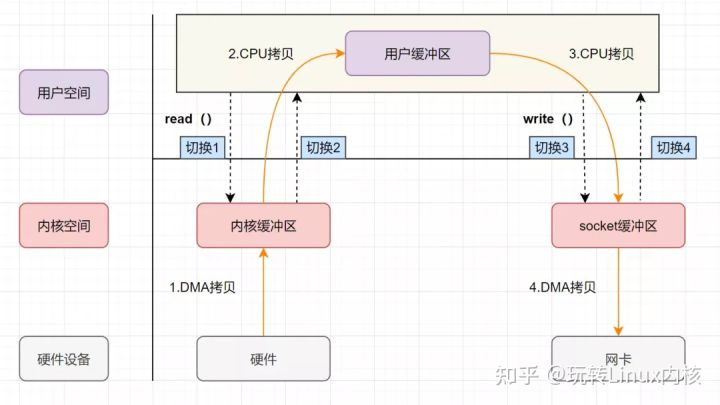
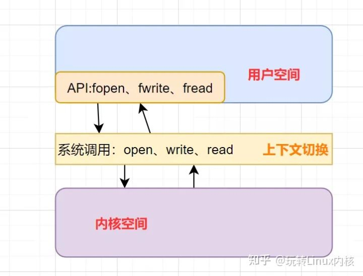
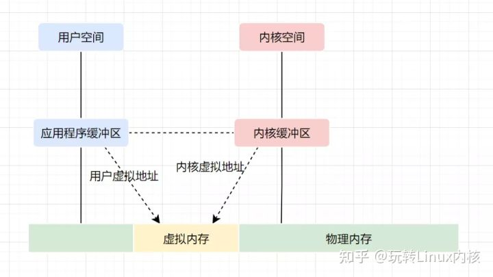
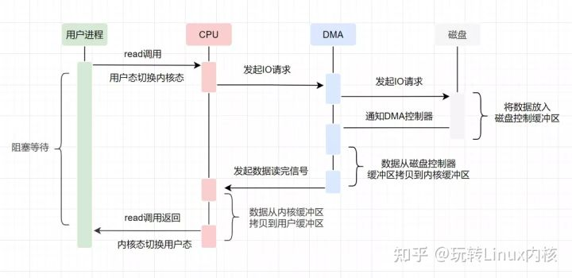
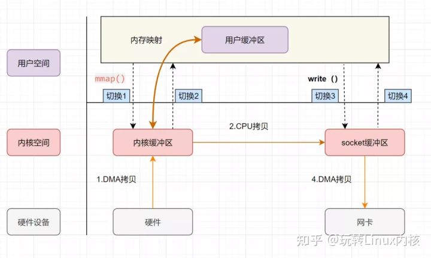
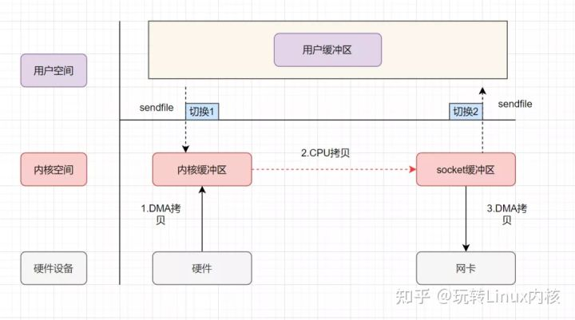
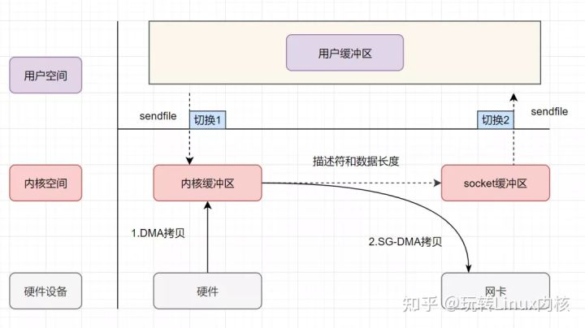

include::attributes.adoc[]

:origin: https://zhuanlan.zhihu.com/p/465570356?utm_source=qq&utm_medium=social&utm_oi=850287384842092544

= 零拷贝

零拷贝是老生常谈的问题啦，大厂非常喜欢问。比如Kafka为什么快，RocketMQ为什么快等，都涉及到零拷贝知识点。最近技术讨论群几个伙伴分享了阿里、虾皮的面试真题，也都涉及到零拷贝。因此本文将跟大家一起来学习零拷贝原理。

== 什么是零拷贝

零拷贝字面上的意思包括两个，“零”和“拷贝”::
- “拷贝”：就是指数据从一个存储区域转移到另一个存储区域。
- “零” ：表示次数为0，它表示拷贝数据的次数为0。
+
合起来，那零拷贝就是不需要将数据从一个存储区域复制到另一个存储区域咯。

TIP: 零拷贝是指计算机执行IO操作时，CPU不需要将数据从一个存储区域复制到另一个存储区域，从而可以减少上下文切换以及CPU的拷贝时间。它是一种I/O操作优化技术。

== 传统 IO 的执行流程
做服务端开发的小伙伴，文件下载功能应该实现过不少了吧。如果你实现的是一个web程序，前端请求过来，服务端的任务就是：将服务端主机磁盘中的文件从已连接的socket发出去。

关键实现代码如下：

[source,java]
----
while((n = read(diskfd, buf, BUF_SIZE)) > 0)
write(sockfd, buf , n);
----
传统的IO流程，包括read和write的过程::
- `read`：把数据从磁盘读取到内核缓冲区，再拷贝到用户缓冲区
- `write`：先把数据写入到socket缓冲区，最后写入网卡设备。

流程图如下：

. 用户应用进程调用read函数，向操作系统发起IO调用，上下文从用户态转为内核态（切换1）
. DMA控制器把数据从磁盘中，读取到内核缓冲区。
. CPU把内核缓冲区数据，拷贝到用户应用缓冲区，上下文从内核态转为用户态（切换2），read函数返回
. 用户应用进程通过write函数，发起IO调用，上下文从用户态转为内核态（切换3）
. CPU将用户缓冲区中的数据，拷贝到socket缓冲区
. DMA控制器把数据从socket缓冲区，拷贝到网卡设备，上下文从内核态切换回用户态（切换4），write函数返回

从流程图可以看出，传统IO的读写流程，包括了4次上下文切换（4次用户态和内核态的切换），4次数据拷贝（两次CPU拷贝以及两次的DMA拷贝)，什么是DMA拷贝呢？我们一起来回顾下，零拷贝涉及的操作系统知识点哈。

【文章福利】小编推荐自己的Linux内核技术交流群:【865977150】整理了一些个人觉得比较好的学习书籍、视频资料共享在群文件里面，有需要的可以自行添加哦！！！前100名进群领取，额外赠送一份价值699的内核资料包（含视频教程、电子书、实战项目及代码)

== 零拷贝相关的知识点回顾

=== 内核空间和用户空间

我们电脑上跑着的应用程序，其实是需要经过操作系统，才能做一些特殊操作，如磁盘文件读写、内存的读写等等。因为这些都是比较危险的操作，不可以由应用程序乱来，只能交给底层操作系统来。

因此，操作系统为每个进程都分配了内存空间，一部分是用户空间，一部分是内核空间。内核空间是操作系统内核访问的区域，是受保护的内存空间，而用户空间是用户应用程序访问的内存区域。 以32位操作系统为例，它会为每一个进程都分配了4G(2的32次方)的内存空间。

- 内核空间：主要提供进程调度、内存分配、连接硬件资源等功能
- 用户空间：提供给各个程序进程的空间，它不具有访问内核空间资源的权限，如果应用程序需要使用到内核空间的资源，则需要通过系统调用来完成。进程从用户空间切换到内核空间，完成相关操作后，再从内核空间切换回用户空间。

=== 什么是用户态、内核态

如果进程运行于内核空间，被称为进程的内核态
如果进程运行于用户空间，被称为进程的用户态。

===  什么是上下文切换

[qanda]
什么是CPU上下文？::
CPU 寄存器，是CPU内置的容量小、但速度极快的内存。而程序计数器，则是用来存储 CPU 正在执行的指令位置、或者即将执行的下一条指令位置。它们都是 CPU 在运行任何任务前，必须的依赖环境，因此叫做CPU上下文。

什么是CPU上下文切换？::
它是指，先把前一个任务的CPU上下文（也就是CPU寄存器和程序计数器）保存起来，然后加载新任务的上下文到这些寄存器和程序计数器，最后再跳转到程序计数器所指的新位置，运行新任务。
一般我们说的上下文切换，就是指内核（操作系统的核心）在CPU上对进程或者线程进行切换。进程从用户态到内核态的转变，需要通过系统调用来完成。系统调用的过程，会发生CPU上下文的切换。

CPU 寄存器里原来用户态的指令位置，需要先保存起来。接着，为了执行内核态代码，CPU 寄存器需要更新为内核态指令的新位置。最后才是跳转到内核态运行内核任务。

=== 虚拟内存

现代操作系统使用虚拟内存，即虚拟地址取代物理地址，使用虚拟内存可以有2个好处::

. 虚拟内存空间可以远远大于物理内存空间
. 多个虚拟内存可以指向同一个物理地址

正是多个虚拟内存可以指向同一个物理地址，可以把内核空间和用户空间的虚拟地址映射到同一个物理地址，这样的话，就可以减少IO的数据拷贝次数啦，示意图如下

=== DMA技术
DMA，英文全称是Direct Memory Access，即直接内存访问。DMA本质上是一块主板上独立的芯片，允许外设设备和内存存储器之间直接进行IO数据传输，其过程不需要CPU的参与。

我们一起来看下IO流程，DMA帮忙做了什么事情::
+

+
. 用户应用进程调用read函数，向操作系统发起IO调用，进入阻塞状态，等待数据返回。
. CPU收到指令后，对DMA控制器发起指令调度。
. DMA收到IO请求后，将请求发送给磁盘；
. 磁盘将数据放入磁盘控制缓冲区，并通知DMA
. DMA将数据从磁盘控制器缓冲区拷贝到内核缓冲区。
. DMA向CPU发出数据读完的信号，把工作交换给CPU，由CPU负责将数据从内核缓冲区拷贝到用户缓冲区。
. 用户应用进程由内核态切换回用户态，解除阻塞状态

可以发现，DMA做的事情很清晰啦，它主要就是帮忙CPU转发一下IO请求，以及拷贝数据。为什么需要它的？

主要就是效率，它帮忙CPU做事情，这时候，CPU就可以闲下来去做别的事情，提高了CPU的利用效率。大白话解释就是，CPU老哥太忙太累啦，所以他找了个小弟（名叫DMA） ，替他完成一部分的拷贝工作，这样CPU老哥就能着手去做其他事情。

== 零拷贝实现的几种方式

零拷贝并不是没有拷贝数据，而是减少用户态/内核态的切换次数以及CPU拷贝的次数。

零拷贝实现有多种方式分别::
. mmap+write
. sendfile
. 带有DMA收集拷贝功能的sendfile

===  mmap+write实现的零拷贝

mmap 的函数原型如下::
+
[source,c]
----
void *mmap(void *addr, size_t length, int prot, int flags, int fd, off_t offset);
----
+
* `addr`：指定映射的虚拟内存地址
* `length`：映射的长度
* `prot`：映射内存的保护模式
* `flags`：指定映射的类型
* `fd`:进行映射的文件句柄
* `offset`:文件偏移量

前面，零拷贝相关的知识点回顾，我们介绍了虚拟内存，可以把内核空间和用户空间的虚拟地址映射到同一个物理地址，从而减少数据拷贝次数！mmap就是用了虚拟内存这个特点，它将内核中的读缓冲区与用户空间的缓冲区进行映射，所有的IO都在内核中完成。

mmap+write实现的零拷贝流程如下::
+

+
. 用户进程通过mmap方法向操作系统内核发起IO调用，上下文从用户态切换为内核态。
. CPU利用DMA控制器，把数据从硬盘中拷贝到内核缓冲区。
. 上下文从内核态切换回用户态，mmap方法返回。
. 用户进程通过write方法向操作系统内核发起IO调用，上下文从用户态切换为内核态。
. CPU将内核缓冲区的数据拷贝到的socket缓冲区。
. CPU利用DMA控制器，把数据从socket缓冲区拷贝到网卡，上下文从内核态切换回用户态，write调用返回。

可以发现，mmap+write实现的零拷贝，I/O发生了4次用户空间与内核空间的上下文切换，以及3次数据拷贝。其中3次数据拷贝中，包括了2次DMA拷贝和1次CPU拷贝。

mmap是将读缓冲区的地址和用户缓冲区的地址进行映射，内核缓冲区和应用缓冲区共享，所以节省了一次CPU拷贝‘’并且用户进程内存是虚拟的，只是映射到内核的读缓冲区，可以节省一半的内存空间。

===  sendfile实现的零拷贝

sendfile是Linux2.1内核版本后引入的一个系统调用函数，API如下：

[source,c]
----
ssize_t sendfile(int out_fd, int in_fd, off_t *offset, size_t count);
----

* `out_fd`:为待写入内容的文件描述符，一个socket描述符。，
* `in_fd`:为待读出内容的文件描述符，必须是真实的文件，不能是socket和管道。
* `offset`：指定从读入文件的哪个位置开始读，如果为NULL，表示文件的默认起始位置。
* `count`：指定在fdout和fdin之间传输的字节数。
* `sendfile` 表示在两个文件描述符之间传输数据，它是在操作系统内核中操作的，避免了数据从内核缓冲区和用户缓冲区之间的拷贝操作，因此可以使用它来实现零拷贝。

sendfile实现的零拷贝流程如下：

sendfile实现的零拷贝::
. 用户进程发起sendfile系统调用，上下文（切换1）从用户态转向内核态
. DMA控制器，把数据从硬盘中拷贝到内核缓冲区。
. CPU将读缓冲区中数据拷贝到socket缓冲区
. DMA控制器，异步把数据从socket缓冲区拷贝到网卡，
. 上下文（切换2）从内核态切换回用户态，sendfile调用返回。
+
可以发现，sendfile实现的零拷贝，I/O发生了2次用户空间与内核空间的上下文切换，以及3次数据拷贝。其中3次数据拷贝中，包括了2次DMA拷贝和1次CPU拷贝。那能不能把CPU拷贝的次数减少到0次呢？有的，即带有DMA收集拷贝功能的sendfile！

=== sendfile+DMA scatter/gather实现的零拷贝

linux 2.4版本之后，对sendfile做了优化升级，引入SG-DMA技术，其实就是对DMA拷贝加入了scatter/gather操作，它可以直接从内核空间缓冲区中将数据读取到网卡。使用这个特点搞零拷贝，即还可以多省去一次CPU拷贝。

sendfile+DMA scatter/gather实现的零拷贝流程如下::
+

+
. 用户进程发起sendfile系统调用，上下文（切换1）从用户态转向内核态
. DMA控制器，把数据从硬盘中拷贝到内核缓冲区。
. CPU把内核缓冲区中的文件描述符信息（包括内核缓冲区的内存地址和偏移量）发送到socket缓冲区
. DMA控制器根据文件描述符信息，直接把数据从内核缓冲区拷贝到网卡
. 上下文（切换2）从内核态切换回用户态，sendfile调用返回。
+
可以发现，sendfile+DMA scatter/gather实现的零拷贝，I/O发生了2次用户空间与内核空间的上下文切换，以及2次数据拷贝。其中2次数据拷贝都是包DMA拷贝。这就是真正的 零拷贝（Zero-copy) 技术，全程都没有通过CPU来搬运数据，所有的数据都是通过DMA来进行传输的。

==  java提供的零拷贝方式
. Java NIO对mmap的支持
. Java NIO对sendfile的支持

=== Java NIO对mmap的支持
Java NIO有一个MappedByteBuffer的类，可以用来实现内存映射。它的底层是调用了Linux内核的mmap的API。

mmap的小demo如下::

[source,java]
----
public class MmapTest {

    public static void main(String[] args) {
        try {
            FileChannel readChannel = FileChannel.open(Paths.get("./jay.txt"), StandardOpenOption.READ);
            MappedByteBuffer data = readChannel.map(FileChannel.MapMode.READ_ONLY, 0, 1024 * 1024 * 40);
            FileChannel writeChannel = FileChannel.open(Paths.get("./siting.txt"), StandardOpenOption.WRITE, StandardOpenOption.CREATE);
            //数据传输
            writeChannel.write(data);
            readChannel.close();
            writeChannel.close();
        }catch (Exception e){
            System.out.println(e.getMessage());
        }
    }
}
----

=== Java NIO对sendfile的支持
FileChannel的transferTo()/transferFrom()，底层就是sendfile() 系统调用函数。Kafka 这个开源项目就用到它，平时面试的时候，回答面试官为什么这么快，就可以提到零拷贝sendfile这个点。

[source,java]
----
@Override
public long transferFrom(FileChannel fileChannel, long position, long count) throws IOException {
return fileChannel.transferTo(position, count, socketChannel);
}
----

sendfile的小demo如下：

[source,java]
----
public class SendFileTest {
public static void main(String[] args) {
try {
FileChannel readChannel = FileChannel.open(Paths.get("./jay.txt"), StandardOpenOption.READ);
long len = readChannel.size();
long position = readChannel.position();

            FileChannel writeChannel = FileChannel.open(Paths.get("./siting.txt"), StandardOpenOption.WRITE, StandardOpenOption.CREATE);
            //数据传输
            readChannel.transferTo(position, len, writeChannel);
            readChannel.close();
            writeChannel.close();
        } catch (Exception e) {
            System.out.println(e.getMessage());
        }
    }
}
----
